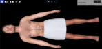

# Virtual Body - Default Virtual Patient App

This application doesn't need installation, see it live at https://bodylight.physiome.cz/Bodylight-VirtualBody/.

If in big screen - use chrome in kiosk mode `chrome.exe --kiosk https://bodylight.physiome.cz/Bodylight-VirtualBody/`

If in VR/AR device open browser and go to URL `https://bodylight.physiome.cz/Bodylight-VirtualBody/` and use the button `ENTER VR`.
## screenshot


## Local installation

This project is bootstrapped by [aurelia-cli](https://github.com/aurelia/cli).
brief installation:
```bash
git clone https://github.com/creative-connections/Bodylight-VirtualBody
npm install
au build
# map web server to host /dist folder or do `au run` and see localhost:...
```
For more information, go to https://aurelia.io/docs/cli/webpack

## Local cache of GLTF files

GLTF files of 3d models are externally hosted on public cloud. You may download it offline by the script:

`python cachemodels.py`
 - this will download the model files into `/static/models` directory which is not part of source control. Scened3d object checks whether local files are available, if not then remote files are downloaded.

## Add new 3d model

- upload to public pcloud - 
- add new entry line to src/components/objects3d.json
- add code to load object into src/components/scene3d.js

## Build for test

Run `au build --watch`. build/virtualbody contains the html and js files - these should be aliased from local apache config.

## Build for production

Run `au build --env prod`.

## Unit tests

Run `au test` (or `au jest`).

To run in watch mode, `au test --watch` or `au jest --watch`.

## Integration (e2e) tests

You need the app running for integration test.

First, run `au run` and keep it running.

Then run `au protractor`.

